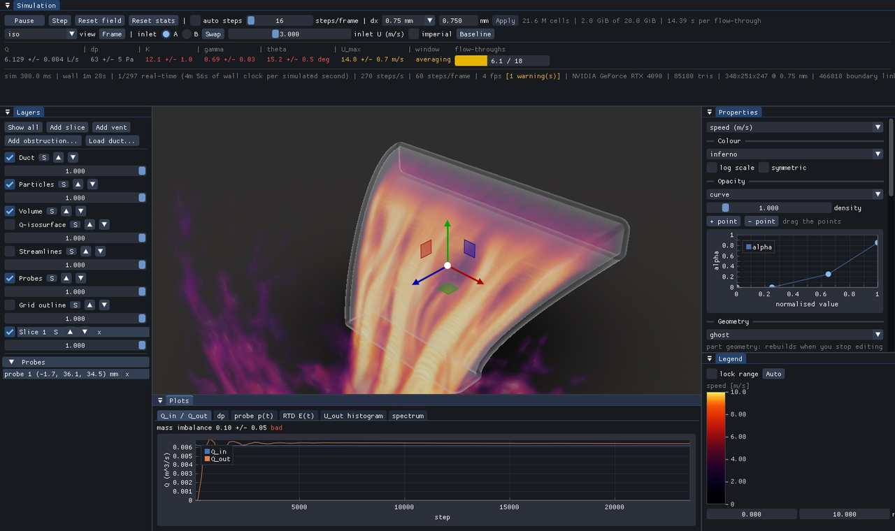
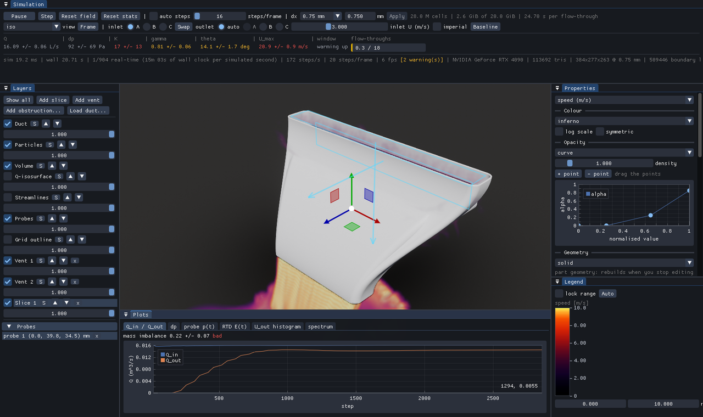
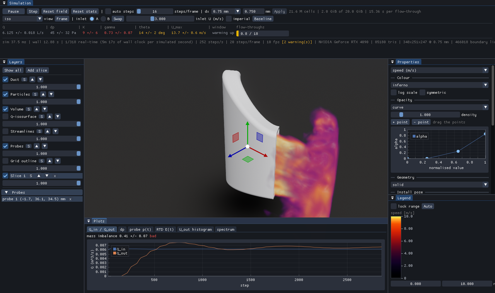

# AeroDuct

Interactive GPU airflow simulation for 3D-printed ducts.



Load an STL, pick which mouth the air comes in through, and watch a
lattice-Boltzmann simulation run on the GPU while the numbers that say whether
the duct is any good (flow rate, pressure drop, loss coefficient, outlet jet
direction) update live. Built for car air-conditioning ducts, where the
question is usually "how much air reaches the vent, and which way does it
leave?".

Pure Rust on [wgpu](https://wgpu.rs) (Vulkan/Metal/DX12), with an optional
CUDA backend. Developed and verified on an RTX 4090; runs on anything with a
few GB of VRAM at a coarser cell size.

## Quick start

```bash
cargo run --release
```

That loads the test duct from `parts/`, found next to the workspace, next to
the executable (how a release package is laid out) or under the current
directory, in that order. To load your own part, pass the STL:

```bash
cargo run --release -- "path/to/duct.stl"
```

Requirements: Rust 1.85 or newer, a GPU with Vulkan, Metal or DX12. No CUDA
toolkit needed unless you enable the `cuda` feature on `ad-cuda`.

The part must be a closed (watertight) solid whose open ends sit flush against
its bounding-box faces. Mouths are detected automatically and named A, B, C in
order of size. The largest is the inlet by default and the largest of the rest
is the outlet; the toolbar lets you pick a different inlet, swap the two, and
on a part with three or more mouths choose the outlet as well.

## What it does

- **Solver**: D3Q19 lattice-Boltzmann, TRT collision with Smagorinsky LES,
  Esoteric Pull streaming, interpolated bounce-back walls. FP32 arithmetic with
  optional FP16 storage. A CPU reference implementation of the same scheme is
  compared against the GPU kernels in the test suite.
- **Geometry**: STL in, voxels out, on the GPU. Mouth detection, watertightness
  checks, and a CPU ray-parity voxeliser that catches leaks in the GPU mask.
- **Rendering**: volume raymarch of speed, pressure, vorticity or
  Q-criterion; slices, isosurfaces, streaklines, line integral convolution,
  TAA, SSAO, bloom. Mesh shown solid, ghosted, wireframe or hidden.
- **Metrics**: Q in/out, mass balance, static and total pressure drop, loss
  coefficient K with error bars, outlet jet direction, wall shear, residence
  time distribution. An analytic 1D estimate gives an instant answer while the
  LBM converges.
- **Scene**: install pose (show the part as mounted in the car), tilted inlet
  air (vent louvers), obstructions loaded from other STLs, free-standing vents
  in the room (multiple air sources), adjustable simulation box.

|  |  |
|---|---|
| Two air sources: vents sealed to mouths A and B of a three-mouth part, Q_in summed, outlet chosen automatically | The same part in its car install pose; the lattice stays aligned to the STL, only the picture turns |

## Controls

| Input | Action |
|---|---|
| Left drag | Orbit |
| Middle drag / Shift+left | Pan |
| Right drag / Alt+left / wheel | Dolly |
| Ctrl+click on the part | Drop a probe |
| Ctrl+click on a mouth | Place a vent sealed to that opening |
| `1`–`7` | View presets (iso, front, back, left, right, top, bottom) |
| `F` | Frame the scene |
| `G` | Cycle mesh display: solid → ghost → wireframe → off |
| `Space` | Pause / resume the solver |
| `F12` | Screenshot |

Keyboard shortcuts need the viewport focused: click it once if a panel has
swallowed the keys.

Select a layer (duct, obstruction, vent, slice) to get a transform gizmo. On
the duct, move/rotate set the install pose and the scale handles resize the
part itself (re-voxelised when you let go).

## Headless runs

Everything can be driven from environment variables for unattended
verification, A/B comparisons and screenshots. Values are validated; a bad one
is ignored with a warning rather than producing a broken run.

```bash
AERODUCT_FRAMES=400 AERODUCT_STEPS=60 AERODUCT_U=3 \
AERODUCT_MESH=ghost AERODUCT_VIEW=left AERODUCT_SHOT=out/run.png \
cargo run --release
```

| Variable | Meaning |
|---|---|
| `AERODUCT_FRAMES=N` | Render N frames, capture, exit |
| `AERODUCT_STEPS=N` | Solver steps per frame (else auto-tuned to 60 fps) |
| `AERODUCT_SHOT=path.png` | Where the final capture goes |
| `AERODUCT_U=m/s` | Inlet speed |
| `AERODUCT_DX_MM=x` | Cell size |
| `AERODUCT_INLET=i` | Inlet mouth index |
| `AERODUCT_MESH=solid\|ghost\|wire\|off` | Mesh display |
| `AERODUCT_VIEW=iso\|front\|back\|left\|right\|top\|bottom` | Camera |
| `AERODUCT_PRECISION=fp16` | FP16 storage (default FP32) |
| `AERODUCT_CS=x` | Smagorinsky constant (0 disables LES) |
| `AERODUCT_ULB=x` | Lattice velocity (auto-lowered when the outlet would exceed 0.1) |
| `AERODUCT_DOMAIN=room\|trimmed\|plenum` | Simulation box style |
| `AERODUCT_DOMAIN_MM=-x,+x,-y,+y,-z,+z` | Box margins by hand, mm |
| `AERODUCT_MARGIN_*`, `AERODUCT_PLENUM_*` | Fine-tune the chosen domain |
| `AERODUCT_POSE=yaw,pitch,roll[,x,y,z]` | Install pose, degrees and mm |
| `AERODUCT_INLET_TILT=updown,sideways` | Louver angle, degrees |
| `AERODUCT_OBSTRUCTION="a.stl[@dx,dy,dz];b.stl"` | Obstructions |
| `AERODUCT_VENT="cx,cy,cz@nx,ny,nz@w,h[@scale];…"` | Vents in the room |
| `AERODUCT_RTD=1` | Residence-time tracers (expensive) |
| `AERODUCT_METRICS=off` | Skip measurement passes |
| `AERODUCT_VRAM_GB=x` | Override detected VRAM for the resolution pre-flight |
| `AERODUCT_TEST_STL=path` | Where tests find the test duct |
| `AERODUCT_PRESENT=fifo\|mailbox\|immediate` | Present mode (headless runs default to fifo) |

A few more exist purely as test handles (`AERODUCT_PREFLIGHT`, `AERODUCT_SET_DX`,
`AERODUCT_FAULT`, `AERODUCT_MEMORY_BUDGET_PCT`); they are documented where they
are parsed in `crates/ad-app/src/main.rs` and `crates/ad-gpu/src/context.rs`.

Logging is `env_logger`; `RUST_LOG=debug` for more.

## Layout

```
crates/ad-gpu       device, shared types, WGSL preprocessor, DDF layout
crates/ad-geom      STL, mesh health, voxeliser, mouth detection
crates/ad-solver    LBM solver + CPU reference implementation
crates/ad-cuda      optional CUDA backend (feature `cuda`)
crates/ad-render    volume/mesh/particle renderer, TAA, post
crates/ad-metrics   flow, pressure, wall and RTD measurements
crates/ad-estimate  1D loss-correlation estimate
crates/ad-ui        ImGui shell, panels, gizmos, install pose
crates/ad-app       the `aeroduct` binary
shaders/            WGSL, grouped by crate
validation/         physics validation (lid-driven cavity vs Ghia 1982,
                    Poiseuille, streaming round-trips, real-part geometry)
parts/              test ducts
```

`CONTRACT.md` is the design contract: the physics decisions already made, the
shared types, and the rules every crate follows. Read it before changing
anything in the solver.

## Testing

```bash
cargo test --workspace --release
```

GPU tests skip cleanly on a machine without an adapter. `verify.sh` runs the
suite plus a set of headless simulations and checks the reported numbers.

## Accuracy

The LBM's loss coefficient is not yet grid-converged on the test part; the
numbers are for comparing designs against each other, not for matching a
datasheet. See the metrics panel's error bars and `CONTRACT.md` for what is
and is not trusted.

## Licence

Apache-2.0. The test ducts in `parts/` are included under the same terms.
